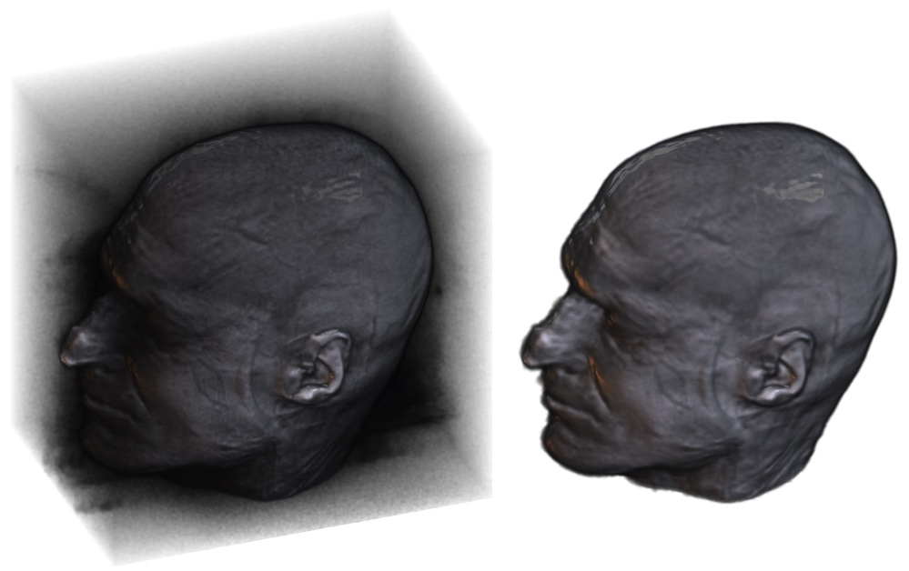
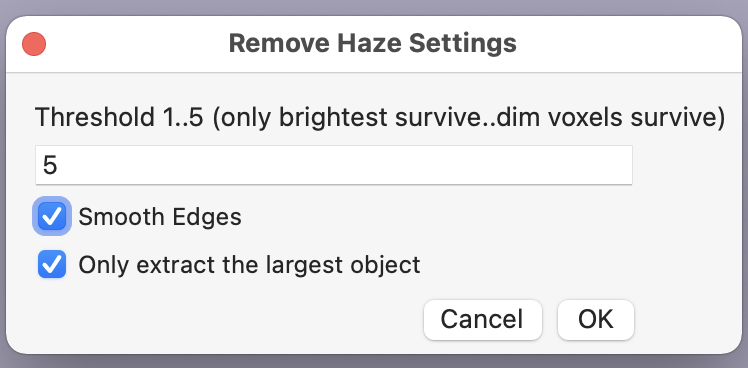

## About

Medical images (CT and MRI scans) typically have some noise visible in the air around the object being scanned. This can make volume renderings appear hazy (left panel of image) and can interfere with [DepthPicking](../DepthPicking). The MRIcroGL `View` menu provides the `Remove Haze` and `Remove Haze with Options` commands that can remove this noise (alternatively, you can also choose `Extract Brain`  for [BET](https://fsl.fmrib.ox.ac.uk/fsl/fslwiki/BET/UserGuide)). This page describes the haze removal. 

MRIcroGL implements [Otsu's method](https://en.wikipedia.org/wiki/Otsu%27s_method) to identify relatively dark voxels and make them the same intensity as the darkest voxel in the volume. A [limitation](https://en.wikipedia.org/wiki/Otsu%27s_method#Limitations) of Otsu's method is that it assumes a bimodal distribution: searchig for a simple black versus white distinction. This is unlike the image distribution of typical MRI scans. For example, the  T1-weighted image histogram reveals four peaks: air as extremely dark, water as dark, muscle and gray matter as gray, and fat (including white matter) as white. To combat this, MRIcroGL implements [multi-Otsu threshold](https://scikit-image.org/docs/dev/auto_examples/segmentation/plot_multiotsu.html).

MRIcroGL's `Remove Haze with Options` menu item allows the user to select a threshold value 1..5. A larger value is more conservative, identifying fewer voxels as air (the `Remove Haze` option is equivalent to running `Remove Haze with Options` at value 5). The threshold values are implemented as:

1. 4-level multi-Otsu, darkest 3 levels thresholded. 
2. 3-level multi-Otsu, darkest 2 levels thresholded. 
3. Traditional 2-level Otsu, darkest level thresholded. 
4. 3-level multi-Otsu, darkest level thresholded.
5. 4-level multi-Otsu, darkest level thresholded. 

Due to [partial volume effects](https://en.wikipedia.org/wiki/Partial_volume_(imaging)), voxels at the surface of an object typically contain a mixture of air and tissue. Making a categorical decision to set voxels to air will tend to create a very jagged surface (impacting the gradient maps in particular). Consider a voxel that is 75% air and 25% tissue, we would expect that it should be brighter than voxels that are 100% air. The `Smooth Edges` checkbox takes this effect into account, preserving the voxel intensity for `air` voxels that neighbor `tissue` voxels.

The `Only extract largest object` menu item is useful if we expect that our image only has a single contiguous object. Any voxels not connected to the largest object will be assumed to be `air`.

## Links

 - This issue is also described in this [blog post](https://github.com/neurolabusc/blog/tree/main/GL-extract).